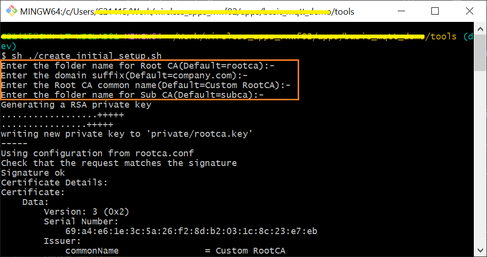

## Generating a Chain of Trust (X.509 Certificates & Keys)

The provided GitBash shell scripts enable easy creation of a chain of trust with minimal steps. These scripts are based on Microsoft Azure's [Create and Upload Certificates for Testing](https://learn.microsoft.com/en-us/azure/iot-hub/tutorial-x509-test-certs?tabs=windows) tutorial.

NOTE: If any problems are encountered with running the scripts, an example chain of trust has been provided in this [sub-folder](../cert-chain-gen-tool/).

### Software Prerequisites

- [GitBash](https://git-scm.com/download/win) or [PowerShell](https://learn.microsoft.com/en-us/powershell/scripting/install/installing-powershell-on-windows?view=powershell-7.3)

### Create Certificates for the Root CA & Intermediate/Subordinate/Signer CA

1. Open a GitBash or PowerShell window and use the `cd` instruction on the command line to navigate to the `\AzureDemo_RNWF\avr128db438_rnwf02\cert-chain-gen-scripts\` directory

2. Run the first shell script by executing one of the below commands (if the first one doesn't work, try the second one). The script requires the user to input information about the Root CA & Intermediate/Subordinate/Signer CA. Default values are provided for each parameter which can be accepted by leaving the field blank and hitting [RETURN].

    ```bash
    bash create_initial_setup.sh
    sh ./create_initial_setup.sh
    ```

    </p>

3. Upon successful execution of this script, the below 3 new folders will be created. The certificates (*.crt files) for the Root CA and the Intermediate/Subordinate/Signer CA can be found in each of their respective sub-folders (e.g. `rootca` & `subca`). 

    </p>

### Create the Device Certificate & Key based on a Unique Common Name (CN)

1. Open a GitBash or PowerShell window and and use the `cd` instruction on the command line to navigate to the `\AzureDemo_RNWF\avr128db438_rnwf02\cert-chain-gen-scripts\` directory

2. Execute one of the below commands to create the device certificate and key (if the first one doesn't work, try the second one). The script requires the user to provide the Subordinate/Intermediate/Signer CA folder name and a unique device ID (a.k.a. the "Common Name"). The device certificate that is generated will be signed by the Subordinate/Intermediate/Signer CA which was created previously.

    ```bash
    bash create_device_certificate.sh
    sh ./create_device_certificate.sh
    ```

    </p>

3. Upon successful execution of device certificate script, a new folder (named after the Common Name) is created inside the `../cert-chain-gen-scripts/devcerts` folder as shown in following screenshot. The device certificate corresponds to the `<Common_Name>.pem` file and the device key corresponds to the `<Common_Name>.key` file:

    </p>

4. [OPTIONAL] In order to modify the default subject identifier information, you can open the *create_device_certificate.sh* file and update the following macros:

    </p>
