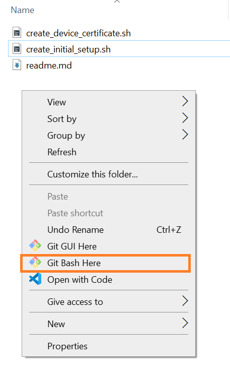
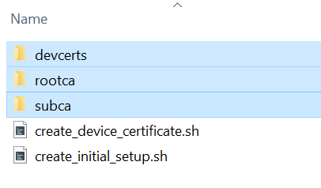

### Certificate Infrastructure 

The provided GitBash Shell scripts enable easy creation of certificate infrastructure and individual device certificates with very minimal user inputs.

These scripts are based on the Azure's [Create and Upload Certificates for Testing](https://learn.microsoft.com/en-us/azure/iot-hub/tutorial-x509-test-certs?tabs=windows) tutorial.

#### Prerequisit

- [GitBash](https://git-scm.com/download/win)

#### Initial Infrastructure

1) Clone the Certificate infrastructure tools

2) Right click and open the GitBash in the tools folder

3) Run the *create_initial_setup.sh* as shown in the following screenshot. It will request the user to provide the domain suffix and common name for Root CA. 

Up on successful execution of above command, following 3 new folders will be created!

#### Device Certificate

1) Run the *create_device_certificate.sh* to create individual device certificate. It requests the user to provide Subordinate/Intermediate CA folder name and a unique device id (Common Name).

Note:- In order to modify the default subject identifier information, open the *create_device_certificate.sh* and update the following macros.

2) On successful execution of device certificate, a new folder is created inside the *../tools/devcerts* folder as shown in following screenshot

3) The *\<device id\>.pem* and * \<device id\>.key* files highlighted/marked above should be programmed into the RNWF device using the AT commands or through the *[cert key flash tools]()*
